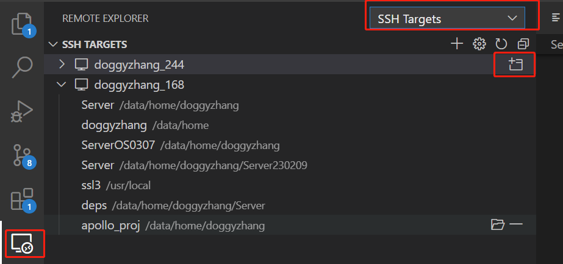
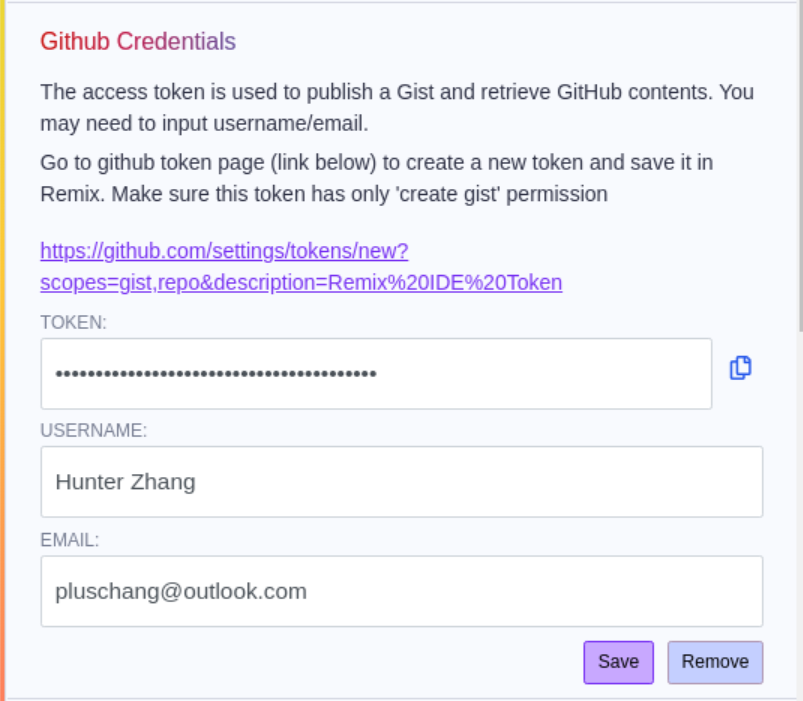
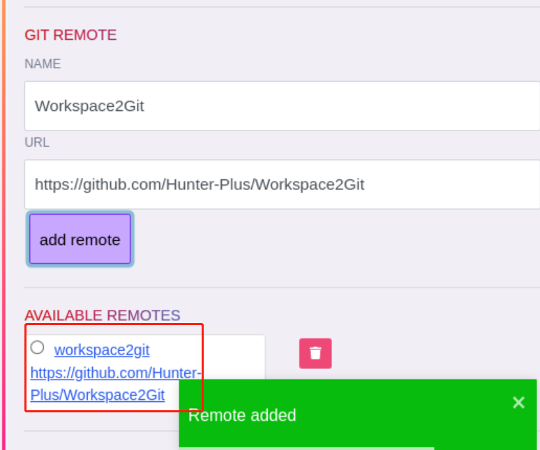

# Basic Tools(root)
sudo add-apt-repository main
sudo add-apt-repository universe
sudo add-apt-repository restricted
sudo add-apt-repository multiverse
apt-get update
sudo apt install nautilus -y
sudo apt install x11-apps -y
sudo apt install ubuntu-desktop mesa-utils
xauth add $(xauth -f ~root/.Xauthority list|tail -1)
xauth add $(xauth -f ~hunterzhang/.Xauthority list|tail -1)


# Add User
Considering the stability of the dev environment, I highly recommend that to develop as a notmal user rather than the root. I will use the username, hunterzhang, as the example in the following wiki. \
Log in you Linux system as the root user:
```console
adduser hunterzhang
passwd hunterzhang
```
Or you can set the password of the new user by:
```console
echo "hunterzhang:qwert12345" | chpasswd
```
## Change Home Path(optional)
Sometimes it is necessary to set your home path to another disk. \
Using data/home/hunterzhang as an example.\
We can change the home path mannually by:
```console
vi /etc/passwd
```
Or get the UID firstly by:
```console
id hunterzhang
```
Then
```console
cd /data/home
chown -R hunterzhang:hunterzhang  hunterzhang
chmod -R 700 hunterzhang
```
## Set Default User(WSL)
```console
ubuntu config --default-user <username>
```
# Configure SSH connection(from Windows)
## Reinstall and Configure openssh server
sudo apt-get remove openssh-server
sudo apt-get install openssh-server

Any available port is okay for the config:
```console
sudo vi /etc/ssh/sshd_config
```

```json
Port 36000
PasswordAuthentication yes
AllowTcpForwarding yes
```

```console
sudo service ssh restart
```
You can check if the service is up by:
```console
ps -e | grep ssh
#or
sudo service ssh status
```

## Add Public Key
Upload id_rsa.pub from Windows OS to Linux OS at your ssh directory, for example, ~/.ssh$. \
Add you public key into the Linux OS: \
```console
cat id_rsa.pub >> authorized_keys
cd ..
chmod -R 700 .ssh/
chmod 600 .ssh/authorized_keys
```
## Test SSH Connection
Make sure the Ip address and port for the SSH connection by:
```console
ip addr
```
Then test the connection from Windows CMD: \
WSL's IP is 127.0.0.1, you should use yours here:

```console
ssh hunterzhang@127.0.0.1 -p36000
```


# Generate RSA Keys(Linux)
Execute the following command:
```console
ssh-keygen -t rsa
```
Then you can change or use the default file path/password. \
To change the file permissions:
```console
chmod -R 700 .ssh/
chmod 600 authorized_keys 
```

# Git
Git has been preinstalled by most Linux OSs, but we still need to add our public key to Github or your Git service. \
Copy the text in the ~/.ssh/id_rsa.pub and add it to your Git then it is done.

# VS Code(Remote)
Install the Remote Development Extension for VS Code. \

## WSL
Normally, the Remote - WSL will be automatically set if your WSL is ready. \
You can use it here: \

## SSH
You should change the setting of each components here: \

 \
Then open the configuration file: \
Ctrl + P \
input '>' \
Remote-SSH:Open Configuration File \
C:\Users\hunterzhang\.ssh\config

Add SSH as you wish: \
 \
 

# Remix IDE

## npm & Node.js & docker & pip
```console
sudo apt install npm -y
sudo apt install docker.io -y
sudo apt install python3-pip -y
```

## Remixd/AppImage
Install remixd for the deb version: \
```console
npm install -g @remix-project/remixd
remixd -i slither
```

Or download AppImage version from Github: \
```console
wget https://github.com/ethereum/remix-desktop/releases/download/v1.3.6/Remix-IDE-1.3.6.AppImage
```

Run it: 
```console
./Remix-IDE-1.3.6.AppImage
# or
remix-ide
```

For some Error info:
```console
export LIBGL_ALWAYS_INDIRECT=1
export DISPLAY=:0
```


# Ganache

```console
wget https://github.com/trufflesuite/ganache-ui/releases/download/v2.7.1/ganache-2.7.1-linux-x86_64.AppImage
```
# VS Code + Git + Remix(Smart contract dev environment)
After the basic setup of both Linux and Windows OS, please make sure the following tools are functional in your dev environment before we start this part. \
### 1.VS Code(remote, as the IDE)
You have the access to your remote file system on WSL/Linux through VS Code Remote Development Extension with proper keys and settings. That'means you can now developing locally on your Windows os but all your codes should be complied and executed on the remote machine/WSL.
### 2.Remix IDE(on Linux, as the project manager)
You can use your Remix IDE installed on the Remote/WSL OS with GUI. And the dependences are already installed, especially the remixd.
### 3.Git(Github or your own git system, as the version controller)
Make sure your user on the Remote/WSL has the SSH access to your Git system, usually you should configure your RSA key on your Giy system for this.

## Introduction
With this VS Code + Git + Remix environment, you can **create and run&deploy** your smart contract projects on Linux OS by Remix and other tools it supports. In the past we can simply use the **Ethereum Remix Extension** of VS Code for this but the extension was somehow **DEPRECATED**. I know Remix IDE Desktop is not a perfect choice because it is highly encapsulated and be tied to Ethereum and Solidity. Afterall, at this point, Remix IDE is the best project manager tool for Solidity developers, especially for beginners. You can replace it by a bunch of customized tools as you wish. \
Next we should link Remix IDE to Git. As Remix IDE is not good enough for a IDE, espically when running remotely. I'm still enjoy so many good features of VS Code such as Editor Split and shortcuts. To develop on VS Code while to run by Remix, we need a third-part version controller. We need a remote version controller anyway, right?  \
Finally, it's easy to use Git through VS Code as it has a lot of extension on. Enjoy the smooth experience of developing locally on Windows.

## Generate&Set Github Token
By open the setting panel of Remix IDE, you will find the link to generate your Github token. Generate it and configure it on Remix.
 

## Create A Git Repository

 
## Create Workspace as Git Repo
Remix IDE is workspaces based. Check the checkbox to create your workspace as a git repository.
 
When this done, Remix IDE would automatically create a local git commit.
## Push Workspace to Git
Make sure you have installed **DGIT** plugin of Remix IDE.
 
You can see the initial local commit by click the DGIT logo in the left.
Then, **CLONE, PUSH, PULL & REMOTES -> GIT REMOTE**
 
The new git remote will be available, check it and PUSH to the **master** branch.
 
## Pull Your Project from VS Code
```console
git clone https://github.com/Hunter-Plus/Workspace2Git.git
```
 
When you wanna run a test, you should push your code to Git from VS Code after set your Git information.
## Pull your Workspace from Remix IDE
