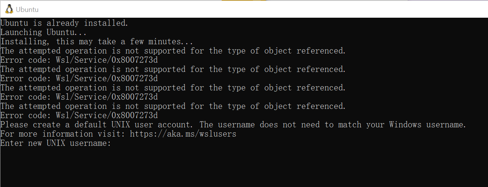
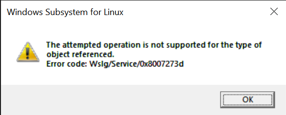

# SWL(optional)
SWL is unnecessary if you have a remote Linux development machine.\
Follow the official document here:https://learn.microsoft.com/en-us/windows/wsl/install \
Set your own user as the default: 
```console
ubuntu config --default-user <username>
```
## GUI
If you wanna use some GUI apps such as Remix Desktop, you should configure the WSL GUI following this document: \
https://learn.microsoft.com/en-us/windows/wsl/tutorials/gui-apps#existing-wsl-install
## Cannot use 'wsl'
```console
wsl : The term 'wsl' is not recognized as the name of a cmdlet, function, script file, or operable program. Check the
spelling of the name, or if a path was included, verify that the path is correct and try again.
At line:1 char:1
+ wsl
+ ~~~
    + CategoryInfo          : ObjectNotFound: (wsl:String) [], CommandNotFoundException
    + FullyQualifiedErrorId : CommandNotFoundException
```
This error occurred the first time I attempted to run
```console
wsl --install
```
in Windows PowerShell as admin.\
This issue have been fixed by simply **switching to CMD as admin** rather than Powershell.

## Wsl/Service/0x8007273d
This error might shows up when SWL installation or reboot is finished, as console error info or a popup dialog.\
\
\
This issue can be solved by running this command as admin and then rebooting the system.
```console
netsh winsock reset
```
# MobaXterm
https://mobaxterm.mobatek.net/ \
Download and install this amazing terminal.
## Add Shell Session
**Sessions->Right Click Meun-> New Session->Shell** \
Add a local Windows Session and set the startup directory to a convenient one. Using an admin account is okay here, as I'm not actually developing on Windows OS.

# Generate RSA Keys(Windows)
Execute the following command using CMD or PowerShell at your user default directory, for example, C:\Users\hunterzhang.
```console
ssh-keygen -t rsa
```
In the prompt, enter a file path such as C:\Users\hunterzhang\ssh.\
Then you can choose whether use a password or note.\
Finally, set the public key file's permission to be readable only by the creator's account, or you will get an error 'Windows SSH: Permissions for 'private-key' are too open'.\

# VS Code
## Windows(Local)
https://code.visualstudio.com/ \
Download and install this amazing IDE. \
Usually, I use VS Code's SSH remote extension to connect to a remote Linux dev environment, and I will put the remote configuration part in the LinuxSetup.md.
